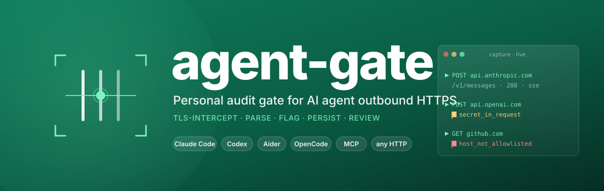
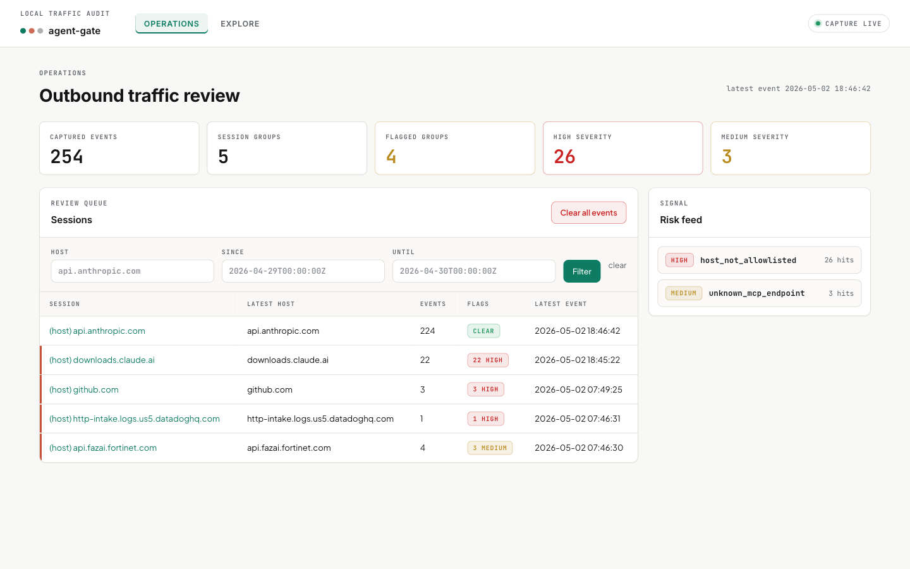
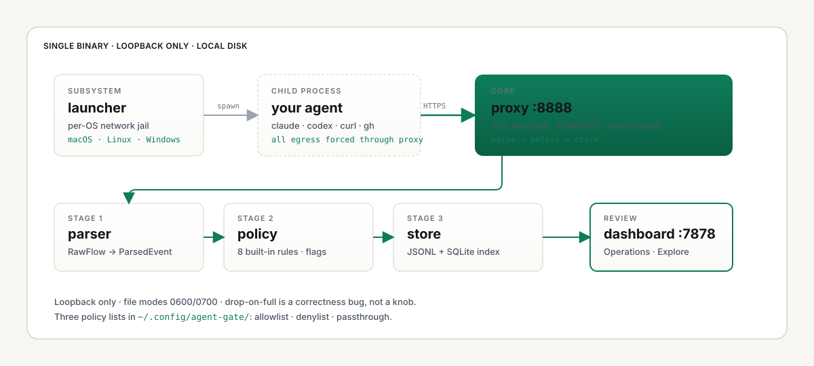
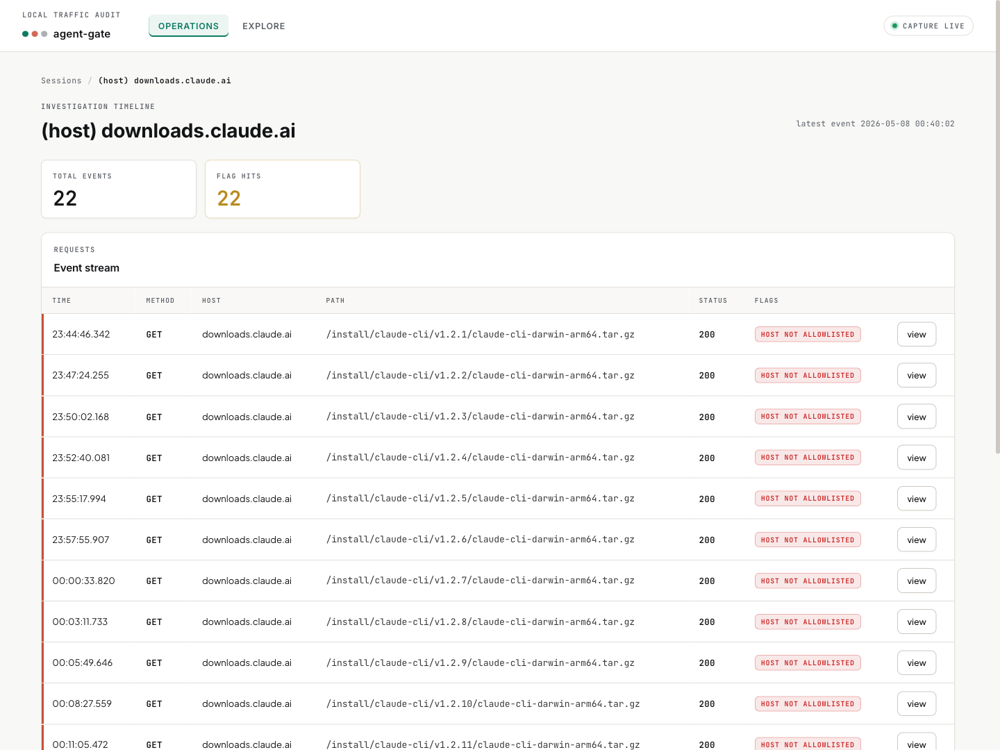
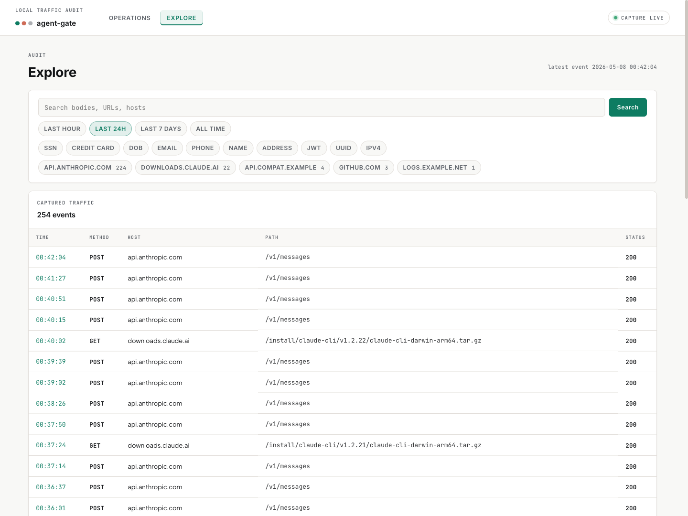
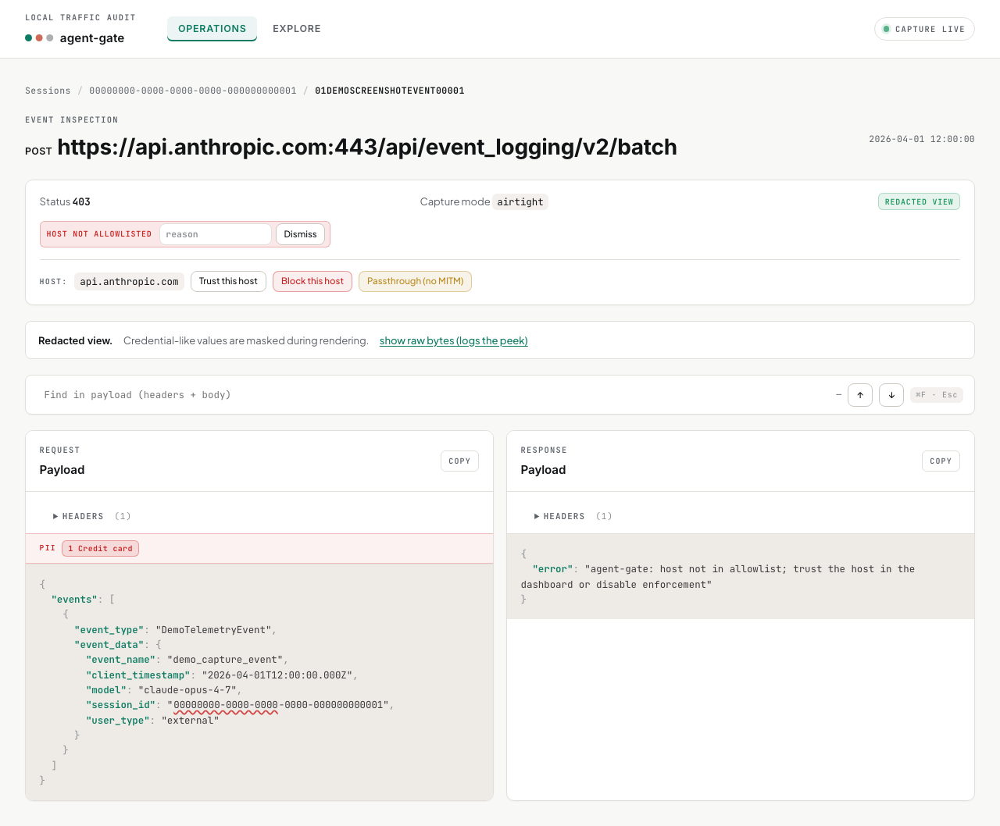

<p align="center">
  
</p>

<p align="center">
  <a href="https://github.com/WZ/agent-gate/releases/latest"></a>
  <a href="LICENSE"></a>
  = 1.25"/>
  
  
</p>

<p align="center">
  <strong>Single-user audit gate for AI agents that talk HTTP.</strong> Whether you run Claude Code, Codex, Aider, OpenCode, an MCP client, or a plain <code>curl</code> in a script, agent-gate sits on your laptop, captures outbound HTTPS through a local proxy, flags + persists each captured flow, and lets you review it all in a local web dashboard. Airtight capture is supported on macOS and Linux today; Windows supports permissive proxy capture while the airtight runtime is in Plan 4. No backend, no telemetry, no cross-machine collation — everything stays on your disk.
</p>

<p align="center">
  
</p>

<p align="center"><em>The Operations dashboard — session catalog with flag counts, captured-event metrics, and a live risk feed.</em></p>

## Support Matrix

agent-gate support has three separate layers:

- **Airtight capture** means `agent-gate run -- <cmd>` puts the agent in an OS-level network jail, so subprocesses and tools that ignore `HTTPS_PROXY` still cannot bypass the local proxy.
- **Permissive capture** means the proxy, dashboard, policy engine, and store work, but the target must honor `HTTP_PROXY` / `HTTPS_PROXY`.
- **Rich parsing** means the dashboard extracts AI-specific fields such as model, token counts, tool calls, tool results, streamed message content, or protocol-specific inventory counts. Today that rich path applies to Anthropic Messages traffic on `api.anthropic.com`, OpenAI-compatible Chat Completions and Responses HTTP calls, and selected Codex/ChatGPT backend setup endpoints on `chatgpt.com`; everything else still gets audited as generic HTTP.

### Platforms

| Platform | Supported today | Current behavior | TODO |
|---|---|---|---|
| **macOS** | Yes | Airtight `agent-gate run` via `sandbox-exec`; proxy, dashboard, `init`, `doctor`, and cert install are supported. | ✅ **None.** Platform parity is complete. |
| **Linux** | Yes, when unprivileged user namespaces are allowed | Airtight `agent-gate run` via user + network namespace. Hardened hosts fall back to permissive unless `--airtight-fail` is set. | Better hardened-distro story if demand justifies it. |
| **Windows** | Partial | Windows binaries, `init`, `doctor`, cert install, proxy, dashboard, and permissive proxy capture exist. Airtight `agent-gate run` is not wired yet and falls back to permissive with a clear message. | **Plan 4:** Job Object + WFP per-exe filters + completion-port listener for descendants. |

### Agents and API Parsing

| Agent / client | Supported today | What is rich today | TODO |
|---|---|---|---|
| **Claude Code** (`claude`) | Yes, primary path | `init` detects `claude` and seeds `api.anthropic.com`. Traffic to that host gets Anthropic Messages parsing: SSE streams, tool calls, tool results, system prompts, and token usage when present. | ✅ **None for the local CLI itself.** It targets `api.anthropic.com` directly. Anthropic on AWS Bedrock and GCP Vertex are separate transports used by other Anthropic-aware clients (Anthropic SDK, custom scripts), and would land as their own fixture-driven parsers when a real capture turns up. |
| **Codex** (`codex`) | Capture yes, with a known WebSocket boundary | `init` detects `codex` and OpenAI base-url env vars, currently seeding `api.openai.com`. Captured OAuth-mode Codex traffic uses `chatgpt.com/backend-api/...`; agent-gate now parses model catalogs, analytics events, connector lists, plugin listings, and MCP-style tool inventory there. Direct OpenAI-compatible Chat Completions and Responses HTTP calls get rich parsing; the actual OAuth-mode model conversation uses WebSockets and is not decoded yet. | Plan 5 Stream B covers deeper Codex WebSocket capture. `chatgpt.com` allowlist seeding also needs to catch up with observed Codex traffic. |
| **Aider** (`aider`) | Capture yes | `init` detects `aider` and seeds `api.anthropic.com` + `api.openai.com`. Traffic to `api.anthropic.com` gets rich parsing, and OpenAI-compatible Chat Completions / Responses HTTP calls now surface model, token, tool-call, and tool-result fields. Other providers are generic HTTP until fixtures land. | More providers need fixtures. |
| **OpenCode** (`opencode`) | Capture yes | `init` detects `opencode` and seeds `api.anthropic.com`. Traffic to `api.anthropic.com` and OpenAI-compatible Chat Completions / Responses HTTP endpoints gets rich parsing; other configured providers may need manual trust and parse as generic HTTP. | Plan 5's parser registry makes new vendor decoders one-file additions. |
| **OpenClaw / Hermes Agent** | Manual capture likely; not first-class today | Launch them with `agent-gate run -- <cmd>` or configure their proxy settings manually. `init` does not detect their binaries or seed their provider hosts yet. Anthropic and OpenAI-compatible Chat Completions / Responses HTTP calls get rich parsing; OpenRouter/custom-provider traffic is captured but mostly generic today. | Future first-class support needs binary detection, provider host seeding, more vendor fixtures, and Codex/ChatGPT WebSocket validation. |
| **curl, scripts, MCP clients, custom agents** | Capture yes | Any HTTPS client can be captured if launched through airtight mode or pointed at the proxy. Anthropic Messages and OpenAI-compatible Chat Completions / Responses HTTP calls get rich parsing; other hosts parse as generic HTTP today. | Add first-class decoders as real fixtures are captured. |

## Features

- **Airtight launcher** — `agent-gate run -- claude` spawns the target inside a per-OS network jail on macOS and Linux that physically forces every byte of egress through the local proxy. Subprocesses inherit the jail. Tools that don't honor `HTTPS_PROXY` get kernel-level network deny. Windows currently falls back to permissive capture; see the support matrix above.
- **TLS-MITM proxy with passthrough escape hatch** — every HTTPS request is decrypted, parsed, flagged, and re-encrypted toward the upstream. Cert-pinned hosts (`mcp-proxy.anthropic.com` and friends) get raw TCP tunneling instead, so MITM-rejecters still work — connection metadata gets audited even when bodies can't.
- **Three-list policy model** — `allowlist.txt`, `denylist.txt`, `passthrough.txt` in `~/.config/agent-gate/`. Mutated only by `init`, the dashboard, or your editor — never by the runtime. Resolution order: deny wins, then passthrough, then enforce-mode allowlist gate, then default audit-and-forward.
- **Eight built-in policy rules** — `host_not_allowlisted`, `secret_in_request`, `env_in_tool_result`, `oversized_request`, `oversized_response`, `unknown_mcp_endpoint`, `permissive_capture`, `parse_error`. Per-flag dismiss with reason + timestamp.
- **PII detection across the wire** — every captured event is scanned for SSN, credit cards, DOB, email, phone, name, address, JWT, UUID, IPv4. The Explore page colors body text by kind so you can spot what slipped through at a glance.
- **Parser registry** — Anthropic Messages SSE streams are reassembled into single review-ready events, tool calls and tool results are split out, and system prompts are surfaced. OpenAI-compatible Chat Completions and Responses HTTP calls surface model, token counts, tool calls, and tool results. Selected Codex/ChatGPT backend setup endpoints are parsed into inventory-style events. Generic HTTP fallback covers the remaining Aider, OpenCode, OpenClaw, Hermes Agent, MCP, and custom-agent traffic until more Plan 5 parsers land.
- **One-command bootstrap** — `agent-gate init` writes the config, mints a local CA, detects which agents you have installed (`claude`, `codex`, `aider`, `opencode`), seeds their upstream hosts into your allowlist, and installs the CA into Keychain (macOS), `ca-certificates` + Firefox NSS (Linux), or wincrypt (Windows). OpenClaw and Hermes Agent are manual-capture paths until their profiles land.
- **`doctor` validate-and-repair** — checks every moving part (CA files, ports, lockfile, host-list permissions, agents detected, CA trusted across all stores) and prints one line per check. `--auto-repair=safe` for filesystem fixes; `--auto-repair=aggressive` will retry trust-store install.
- **JSONL + SQLite store** — every captured flow lands on disk. JSONL is the source of truth; SQLite is an index over it. `agent-gate reindex` rebuilds the index from JSONL whenever you want.
- **Single binary, pure Go** — no CGO, cross-compiles cleanly to darwin/linux/windows × amd64/arm64. Distributed via [GitHub Releases](https://github.com/WZ/agent-gate/releases/latest) on every tag.

## Quick Start

```bash
# 1. Install — grab the binary for your platform from the latest release
#    (download from https://github.com/WZ/agent-gate/releases/latest)
tar xz < agent-gate_<ver>_<os>_<arch>.tar.gz
sudo mv agent-gate /usr/local/bin/

# 2. Bootstrap (one-time): writes config, mints a local CA, installs it into your trust stores
agent-gate init

# 3. Run your agent through it
agent-gate run -- claude
```

Then open <http://127.0.0.1:7878> to review what your agent is doing. See [Install](#install) below for the exact archive names.

On macOS and supported Linux hosts this runs in airtight mode by default. On Windows today it falls back to permissive capture; use the standalone proxy flow below or track Plan 4 for the airtight runtime.

For headless / CI use:

```bash
agent-gate init --non-interactive --allow-host api.anthropic.com --install-cert=false
agent-gate cert install   # run later from a TTY
```

To validate the install at any time: `agent-gate doctor`.

## How It Works

Three subsystems share one binary. On macOS and supported Linux hosts, the launcher spawns the target inside a per-OS network jail. The proxy decrypts each HTTPS request, runs it through a parser → policy → store pipeline. The dashboard reads from the store. Everything is loopback. Nothing leaves your disk.

<p align="center">
  
</p>

The audit-log is non-negotiable: if the storage consumer falls behind, the proxy slows down (and upstream may time out). Drop-on-full would be a correctness bug, not a knob — every captured flow lands on disk, period.

## Operations: what work did the agent do?

The default landing page (`/`) is the **session catalog** — agent sessions grouped by host, with event counts, latest activity, and a flag rollup. Filter by host or time window. Click into any session for the timeline.

Right column is the **risk feed**: every active flag code, severity, and hit count. One glance tells you if anything new fired.

<p align="center">
  
</p>

<p align="center"><em>Session detail — 22 hits to <code>downloads.claude.ai</code>, all flagged <code>host_not_allowlisted</code> because Claude Code auto-updates from a host nobody trusted yet. Decide once, trust the host, move on.</em></p>

## Explore: what data slipped through?

Every captured event in one searchable, filterable table at `/explore`. Filter by PII kind (SSN, credit card, email, JWT, UUID, …), time window, or host. Substring-search request bodies, URLs, and hosts. Host chips show how many events per host so you can scope quickly without typing.

<p align="center">
  
</p>

<p align="center"><em>254 events across 5 hosts. Each row's PII chip (<code>10 UUID</code>, <code>3 EMAIL</code>, etc.) tells you what's in the body before you click.</em></p>

## Event detail: trust, block, or pass through

Click any event for the inspection page. Status, capture mode, the full request/response payload side-by-side. Credential-like values are masked by default — toggle to raw bytes when you actually need them (and the toggle itself logs a `raw_peek` event, so you can't peek silently).

Three host-policy buttons sit at the top of the page: **Trust** (allowlist), **Block** (denylist, returns 403), **Passthrough** (raw TCP for cert-pinned upstreams). Per-flag **Dismiss** writes to `dismissals.json` with a free-text reason.

<p align="center">
  
</p>

<p align="center"><em>A real <code>host_not_allowlisted</code> hit: the proxy returned a synthetic 403 to the agent and saved both sides for review. The body's UUIDs are highlighted by the PII coloring layer.</em></p>

## Airtight launcher

`agent-gate run -- <cmd>` is the recommended way in. On macOS and supported Linux hosts, it spawns the target inside a per-platform network jail that physically forces all egress through the proxy. On Windows today, `run` falls back to permissive capture until Plan 4 lands the runtime path.

| Platform | Mechanism | Notes |
|---|---|---|
| **macOS** | `sandbox-exec` profile denies all `network*` ops except loopback to the proxy port | No installation step. Descendants inherit the sandbox automatically. |
| **Linux** | Hidden `__netns-helper` subprocess enters an unprivileged user + network namespace, binds the proxy port inside it, passes the listener FD back via `SCM_RIGHTS` | Requires `kernel.unprivileged_userns_clone=1` (default on Ubuntu/Fedora). Falls back to `--permissive` on hardened distros unless `--airtight-fail`. |
| **Windows** | WFP provider/sublayer registered by `agent-gate init`; runtime path scaffolded for Plan 4 | Currently stubs to `--permissive` with a clear message. |

### Threat model

agent-gate's airtight mode defends against:

- **Tools that ignore `HTTPS_PROXY`.** They get kernel-level network deny.
- **Subprocess descendants.** The jail is inherited (sandbox profile, network namespace).

It does **not** defend against:

- **Local IPC** — UNIX sockets, named pipes, abstract sockets, shared memory. Out of the proxy's view by design.
- **Root/admin agents.** The user can lift the jail.
- **Filesystem reads.** If the agent reads `.env` and writes it somewhere on disk, agent-gate doesn't see it. The proxy is a network audit, not a filesystem audit.
- **Steganographic exfiltration through allowed hosts.**

If your threat model needs filesystem isolation or RBAC, agent-gate alone is insufficient.

### Flags

```
agent-gate init [flags]
  --quiet                           skip welcome and policy summary notes

agent-gate run [flags] -- <cmd> [args...]
  --permissive                       env-only enforcement (HTTPS_PROXY exported, no kernel jail)
  --airtight-fail                    refuse to fall back to permissive if airtight unsupported
  --enforce-allowlist                proxy returns 403 for hosts not in the allowlist
  --upstream-ca PEM                  extra root CA(s) to trust on proxy→upstream
                                       (use for self-signed ANTHROPIC_BASE_URL)
  --upstream-insecure-skip-verify    skip upstream cert verification entirely
                                       (testing only; captures still happen)
  --config PATH                      config.toml path
```

Default mode is **airtight**. If airtight isn't available on this OS or this host's config, agent-gate prints a warning and falls back to permissive — pass `--airtight-fail` to refuse the fallback.

## Three-list policy model

Three file-backed host lists, all in `~/.config/agent-gate/`, mutated only by `init`, the dashboard, or your editor:

| File | Effect | How to mutate |
|---|---|---|
| `allowlist.txt` | Host is OK; suppresses `host_not_allowlisted`, lets through under `--enforce-allowlist` | Dashboard **Trust** → `POST /api/trust`; or `agent-gate init --allow-host HOST` |
| `denylist.txt` | Proxy returns synthetic 403; never contacts upstream | Dashboard **Block** → `POST /api/block` |
| `passthrough.txt` | Proxy tunnels TCP raw — no TLS interception | Dashboard **Passthrough** → `POST /api/passthrough` |

Resolution order in `mitmConnect`:

```
denylist hit  → 403 (always wins)
passthrough hit (and not denylisted) → raw TCP tunnel
enforce mode + not allowlisted → 403
default → MITM, decrypt, capture, forward
```

`agent-gate help allowlist|denylist|passthrough` prints the long-form explanation in your terminal.

## Built-in policy rules

| Code | Severity | Fires when |
|---|---|---|
| `host_not_allowlisted` | high | Request host is not in the allowlist |
| `secret_in_request` | high | Request body matches a credential pattern |
| `env_in_tool_result` | high | Tool result contains ≥3 KEY=VALUE lines |
| `oversized_request` | medium | Request body > 5 MB |
| `oversized_response` | low | Response body > 5 MB |
| `unknown_mcp_endpoint` | medium | Response is `text/event-stream` and host is unknown |
| `permissive_capture` | info | Session captured under env-only enforcement |
| `parse_error` | info | Parser annotated an error on the flow |

## Install

### Download the binary (recommended)

Grab the archive for your platform from the [latest release](https://github.com/WZ/agent-gate/releases/latest):

| Platform | Archive |
|---|---|
| macOS Apple Silicon | `agent-gate_<ver>_darwin_arm64.tar.gz` |
| macOS Intel | `agent-gate_<ver>_darwin_x86_64.tar.gz` |
| Linux arm64 | `agent-gate_<ver>_linux_arm64.tar.gz` |
| Linux x86_64 | `agent-gate_<ver>_linux_x86_64.tar.gz` |
| Windows x86_64 | `agent-gate_<ver>_windows_x86_64.zip` (permissive capture today; airtight is Plan 4) |

Extract, then move `agent-gate` to a directory on your `PATH`. On macOS, the first run may need `xattr -d com.apple.quarantine ./agent-gate` to clear Gatekeeper.

### Or build from source

```bash
git clone https://github.com/WZ/agent-gate.git
cd agent-gate

# Plain build — produces "agent-gate 0.0.1-dev (commit unknown, built unknown)"
go build -o agent-gate ./cmd/agent-gate

# Or with version metadata baked in (matches what goreleaser ships):
VERSION=$(git describe --tags --always)
COMMIT=$(git rev-parse --short HEAD)
DATE=$(date -u +%Y-%m-%dT%H:%M:%SZ)
go build -trimpath \
  -ldflags="-s -w -X main.version=${VERSION} -X main.commit=${COMMIT} -X main.date=${DATE}" \
  -o agent-gate ./cmd/agent-gate

sudo mv agent-gate /usr/local/bin/
```

> `go install agent-gate/cmd/agent-gate@latest` does **not** work today — the module path in `go.mod` is the bare name `agent-gate` rather than a domain-prefixed path, so the toolchain can't fetch it from a remote. Use the binary download or `go build` from a clone.

## CLI summary

```
Getting started:
  agent-gate init                  one-command bootstrap (config + CA + agent detection + cert install)
  agent-gate doctor                validate the install; suggest or apply repairs

Daily use:
  agent-gate run -- <cmd>          launch a command with airtight network capture
  agent-gate dashboard             run the local web dashboard (foreground)
  agent-gate proxy                 run the proxy alone (foreground)
  agent-gate tail                  live-follow events in the terminal
  agent-gate stop                  send SIGTERM to a stuck `agent-gate run`

Maintenance:
  agent-gate cert install          install the local CA into trust stores
  agent-gate cert uninstall        remove the local CA from trust stores
  agent-gate cert path             print the CA cert path
  agent-gate reindex               rebuild the PII count index from JSONL
  agent-gate uninstall             (Windows) remove the WFP provider/sublayer
  agent-gate version               print version info

Help topics:
  agent-gate help allowlist        explain allowlist semantics
  agent-gate help denylist         explain denylist semantics
  agent-gate help passthrough      explain passthrough semantics
```

Each takes `--config PATH` to point at a non-default `config.toml`.

## Workflow

### Recommended: launch through `agent-gate run`

One command starts the proxy + dashboard + jail and runs your agent inside it:

```bash
agent-gate run -- claude
```

While Claude is running, open <http://127.0.0.1:7878> — sessions, events, and flags appear live. When Claude exits, agent-gate tears everything down and releases the lockfile.

If your shell aliases `claude` with flags (fish/zsh aliases aren't visible to `exec`), invoke through your shell so the alias resolves:

```bash
agent-gate run -- fish -ic 'claude'
```

For a self-hosted Anthropic-compatible endpoint with a non-standard cert:

```bash
echo | openssl s_client -connect your-anthropic-endpoint.example:443 -servername your-anthropic-endpoint.example 2>/dev/null \
  | openssl x509 -outform PEM > /tmp/upstream.pem
ANTHROPIC_BASE_URL=https://your-anthropic-endpoint.example \
ANTHROPIC_API_KEY=$YOUR_KEY \
  agent-gate run --upstream-ca /tmp/upstream.pem -- claude
```

### Alternative: standalone proxy + dashboard

For ad-hoc captures (curl, an existing daemon, a script), run the proxy and dashboard separately and point a client at the proxy via env:

```bash
agent-gate proxy --capture-mode permissive   # terminal 1
agent-gate dashboard                          # terminal 2

HTTPS_PROXY=http://127.0.0.1:8888 \
HTTP_PROXY=http://127.0.0.1:8888 \
NO_PROXY="" \
  curl https://api.anthropic.com/v1/messages \
       -H "x-api-key: $ANTHROPIC_API_KEY" \
       -H "anthropic-version: 2023-06-01" \
       -H "content-type: application/json" \
       -d '{"model":"claude-opus-4-7","max_tokens":50,"messages":[{"role":"user","content":"hi"}]}'
```

Same dashboard at <http://127.0.0.1:7878>. No kernel jail in this mode — the client must honor `HTTPS_PROXY`.

## Where things live

- Config: `~/.config/agent-gate/config.toml`
- CA: `~/.config/agent-gate/ca/{cert.pem,key.pem}` (key is 0600 on macOS/Linux; Windows skips the unix-mode check)
- Allowlist / denylist / passthrough: `~/.config/agent-gate/{allowlist,denylist,passthrough}.txt`
- Dismissals: `~/.config/agent-gate/dismissals.json` (also logs `raw_peek` events)
- Lockfile: `~/.local/share/agent-gate/agent-gate.lock` — auto-reclaimed if stale
- Data: `~/.local/share/agent-gate/{events.db, YYYY-MM-DD.jsonl}`

## What's next

See [`TODOS.md`](TODOS.md). The next active and deferred cuts are:

- **Plan 5 Stream B (`v0.3.0`)** — Codex WebSocket capture. v0.2.0 already shipped OpenAI-compatible HTTP parsing; the next blind spot is Codex OAuth-mode model traffic on `chatgpt.com` WebSockets.
- **Plan 4 (`v0.4.0`)** — Windows airtight runtime: Job Object + WFP per-exe filters + completion-port listener for descendants. Removes the "pending Plan 4" stub from `agent-gate run` on Windows.

## What we explicitly don't do

- **Block at the network layer for non-allowlisted hosts unless `--enforce-allowlist` is on.** The default posture is *audit, don't drop*. Allowlist is an annotation, not a firewall, by default.
- **Decrypt cert-pinned upstreams.** When the agent's MCP client pins `mcp-proxy.anthropic.com`, agent-gate's MITM fails. We tunnel TCP raw via passthrough — body audit isn't possible, only connection metadata.
- **Detect filesystem exfiltration.** agent-gate audits network. If the agent reads `.env` and writes it somewhere on disk, we don't see it.
- **Run as a service / agent / daemon.** Single-shot supervisor + dashboard per `agent-gate run`. The lockfile enforces "one instance at a time."
- **Ship to a remote backend.** No telemetry, no upload, no cross-machine collation. Everything stays local.

## Limitations

- HTTP/1.1 client-facing; upstream HTTP/2 transparent.
- Windows airtight is stubbed — Windows targets fall back to `--permissive` with a clear message. Plan 4 lands the Job Object + WFP filter runtime path.
- macOS airtight only matches loopback to the proxy port (no other localhost ports). MCP-over-localhost-HTTP works because the proxy reaches into the child's loopback, not the other direction.
- Linux airtight requires `kernel.unprivileged_userns_clone=1`. Hardened distros (Ubuntu 24+ with `apparmor_restrict_unprivileged_userns=1`, hardened kernels) fall back to `--permissive` unless `--airtight-fail` is set.
- Codex OAuth-mode model traffic uses WebSockets through `chatgpt.com`. agent-gate parses selected HTTP setup/catalog endpoints today, but not the actual prompt/response stream yet. Add `chatgpt.com` manually if you use `--enforce-allowlist`.
- Cert-pinned upstreams reject TLS interception. Add them to `passthrough.txt` so agent-gate tunnels TCP raw — body capture is skipped, only the CONNECT host + byte counts get audited.
- Some TUIs (Claude Code) catch SIGINT and don't propagate exit on Ctrl-C. Type `/exit` inside Claude or run `agent-gate stop` from another terminal.
- Custom rules via TOML config: schema is reserved but not yet wired.

## Project layout

```
cmd/agent-gate/        CLI entrypoint (one file per subcommand)
internal/runtime/      Shared startup; XDG-aware paths; lockfile
internal/launcher/     Cross-platform supervisor + per-OS jail
internal/proxy/        goproxy-based TLS-intercepting forward proxy
internal/parser/       RawFlow → ParsedEvent (Anthropic-aware + generic)
internal/policy/       Rule engine + 8 built-ins
internal/store/        JSONL writer + SQLite index + PII index
internal/dashboard/    HTTP server, HTMX templates, embedded assets
internal/{allowlist,denylist,passthrough}/  file-backed host lists
internal/dismissals/   flag dismissals (JSON file)
internal/redactor/     secret-mask render layer
internal/pii/          PII detection
internal/secrets/      single regex set (shared by policy + redactor)
internal/ca/           local CA mint + leaf signing; cross-platform truststore install
internal/agentdetect/  detect installed agents via $PATH + env vars (IDN-safe)
internal/initwizard/   `agent-gate init` orchestrator
internal/doctor/       `agent-gate doctor` checks + repair
internal/idgen/        ULID
internal/types/        shared structs
internal/e2e/          end-to-end tests
```

## Development

```bash
go build -o /tmp/agent-gate ./cmd/agent-gate    # build
go test ./...                                   # unit tests
go test -race ./...                             # race detector
go vet ./...
gofmt -l .                                      # MUST be empty before commit

# cross-compile sanity
GOOS=linux   go build ./...
GOOS=windows go build ./...
GOOS=darwin  go build ./...
```

CI matrix at `.github/workflows/ci.yml` runs Go 1.25 across ubuntu / macos / windows, plus a `vet-race-fmt` job on Linux.

## License

[Apache 2.0](LICENSE)
